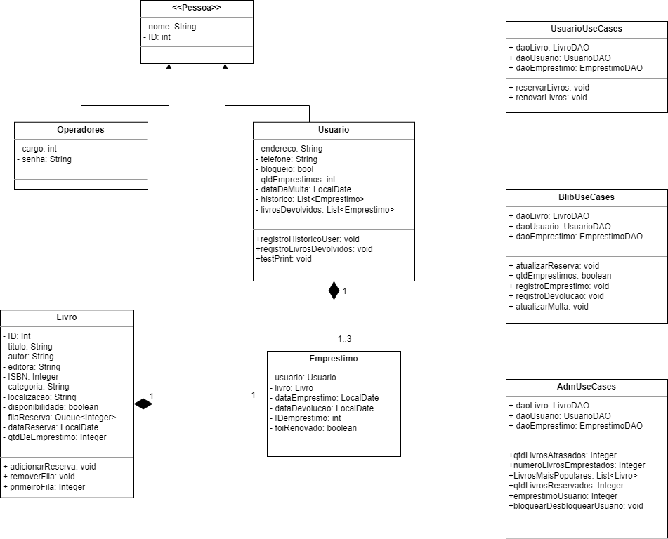
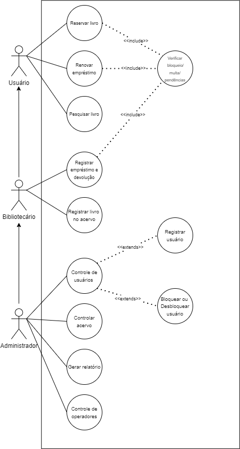

# Sistema de biblioteca
 Sistema de biblioteca, como quesito avaliativo da disciplina de MI algoritmos II, da Universidade Estadual de Feira de Santana (UEFS).

### Conhecimentos adquiridos

- Classes e Objetos
- Interface
- Classe Abstrata
- Herança
- Padrão de Projeto DAO (Data Access Object)
- Padrão de Projeto Singleton
- Diagrama de Classes
- Arquivos em Java

### Diagrama de Classes



### Diagrama de casos de uso



### Requisitos do sistema
1. **Registro de Livros:** O sistema deve permitir o registro de novos livros no sistema, incluindo informações como título, autor, editora, ISBN, ano de publicação e categoria.
2. **Pesquisa de Livros:** Os usuários devem ser capazes de pesquisar livros por título, autor, ISBN ou categoria, a fim de encontrar informações sobre disponibilidade, localização e outras informações relevantes.
3. **Empréstimo e Devolução:** O sistema deve permitir o registro de empréstimos de livros para os usuários da biblioteca. Isso inclui a possibilidade de registrar a data de empréstimo, a data de devolução esperada e a identificação do usuário que realizou o empréstimo. Além disso, o sistema deve permitir o registro da devolução dos livros e a atualização da disponibilidade do livro.
4. **Reserva de Livros:** Os usuários devem ter a opção de reservar livros que estejam emprestados por outros usuários. O sistema deve registrar a reserva por ordem de solicitação.
5. **Renovação de Empréstimos:** O sistema deve permitir a renovação dos empréstimos de livros, desde que não haja outras reservas para o mesmo livro e o limite de renovações não tenha sido atingido.
6. **Controle de Usuários:** O sistema deve permitir o cadastro de novos usuários, com informações como nome, endereço, telefone e número de identificação. Além disso, deve ser possível bloquear uma conta, não permitindo que o usuário faça empréstimos e renovação.
7. **Relatórios e Estatísticas:** O sistema deve ser capaz de gerar relatórios e estatísticas, como número de livros emprestados, atrasados e reservados; histórico de empréstimos de um usuário específico; e livros mais populares.
8. **Gerenciamento de Multas:** O sistema deve ser capaz de calcular e registrar multas por atraso na devolução de livros. O usuário deverá ser multado com o dobro de dias em atraso.
9. **Gerenciamento de Acervo:** O sistema deve permitir o gerenciamento do acervo da biblioteca, incluindo adição, remoção e atualização de informações sobre os livros, além do controle de estoque.
10. **Controle de operadores do sistema:** O sistema deve permitir o cadastro de novos operadores, com informações como nome, número de identificação, cargo e senha de acesso. Os cargos podem ser do tipo Administrador ou Bibliotecário. O Bibliotecário só terá acesso às funcionalidades #1, #2 e #3.

### Estrutura de diretórios para desenvolvimento
- [model](src/main/model): modelos de dados do sistema
- [dao](src/main/dao): implementação do padrão DAO (Data Access Object)
- [testes](src/test): testes da fase 1
- [exceções](src/main/exceptions): exceções da fase 1
- *controller (em breve...):*
- *view (em breve...):*
## Desenvolvimento

### Instalação

Faça o download do repositório

```
git clone https://github.com/eugabrielbr/sistema-de-biblioteca.git
```

E abra o projeto no IntelliJ IDEA e aguarde o download das dependências.

## Executando os testes de unidade 

Para rodar os testes de unidade, baixe o repositório e abra pela IDE Intellij. Depois, abra o arquivo em "open project" e clique com o botão direito na pasta "test", executando logo em seguida a função "Run all tests".

## Ferramentas

* [IntelliJ IDEA Community](https://www.jetbrains.com/idea/download/) - IDE utilizado para codificação

